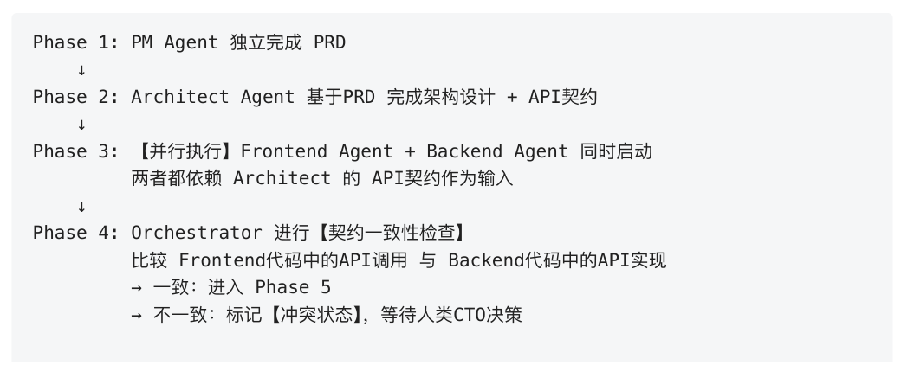
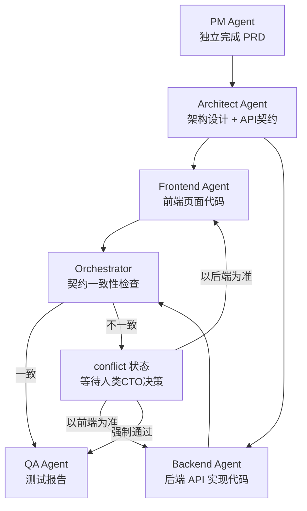
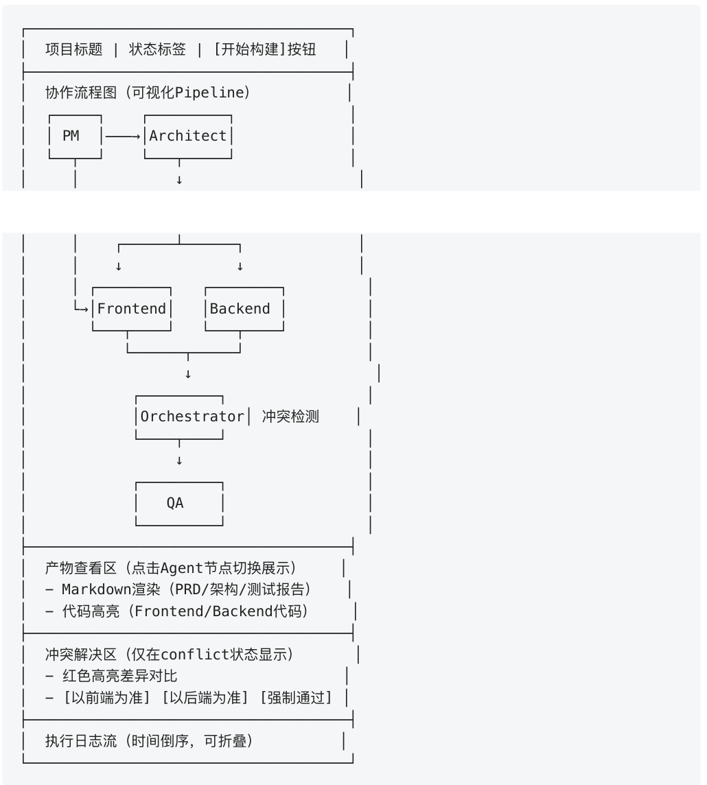
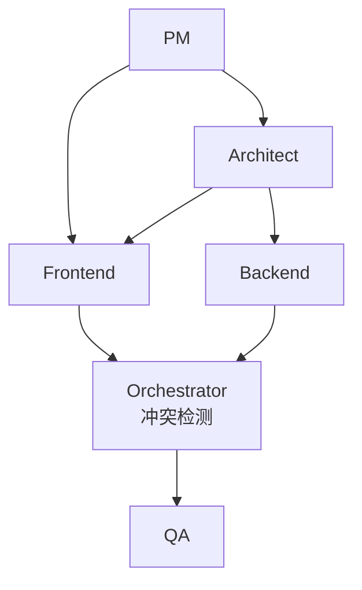
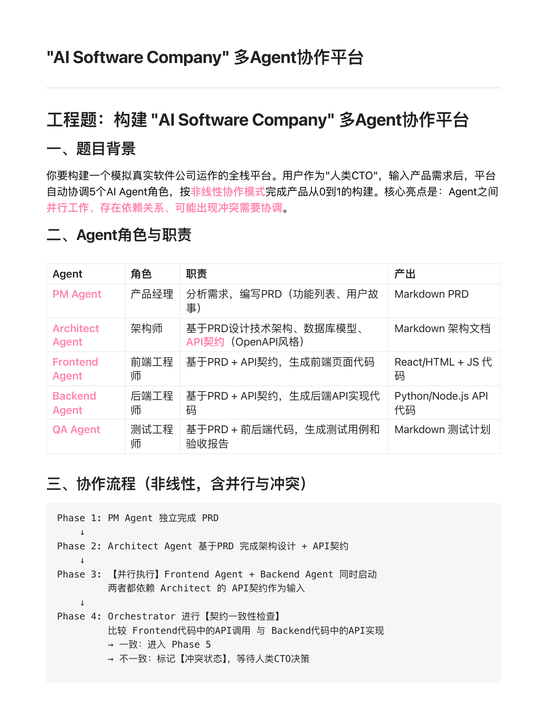
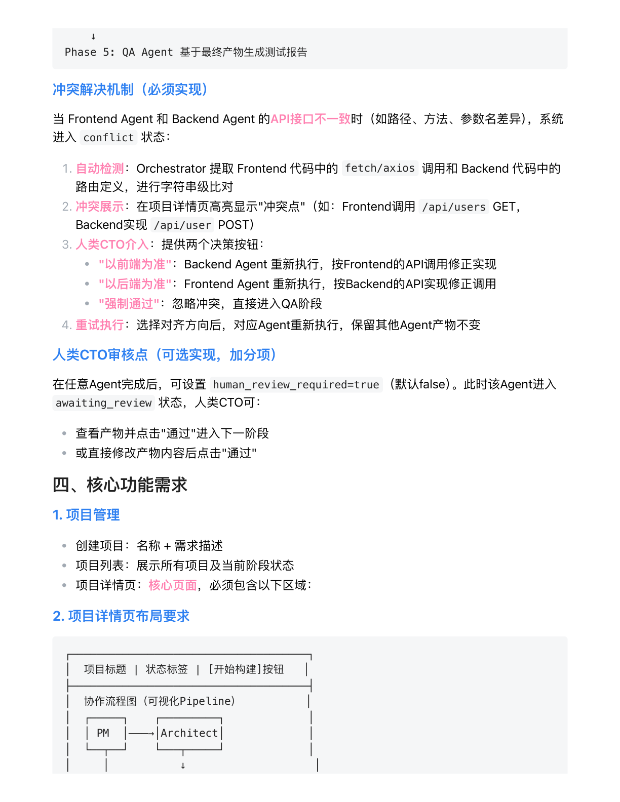
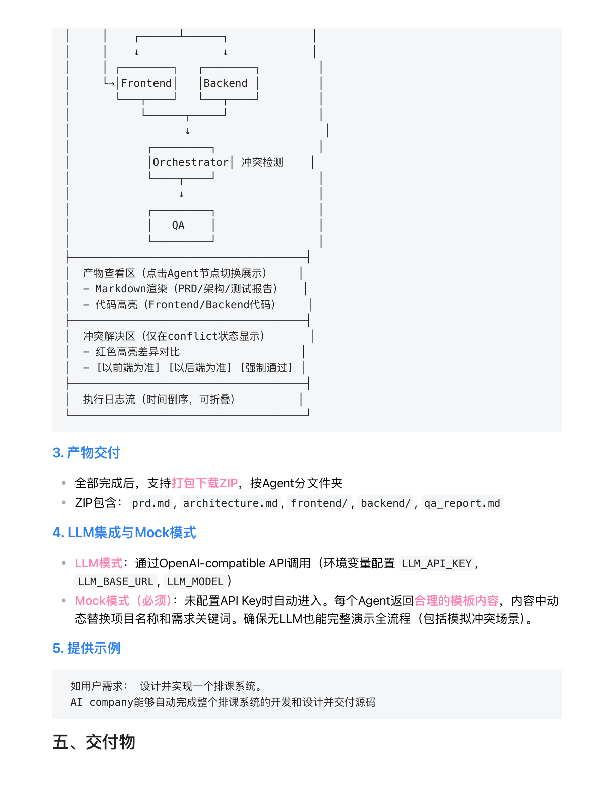
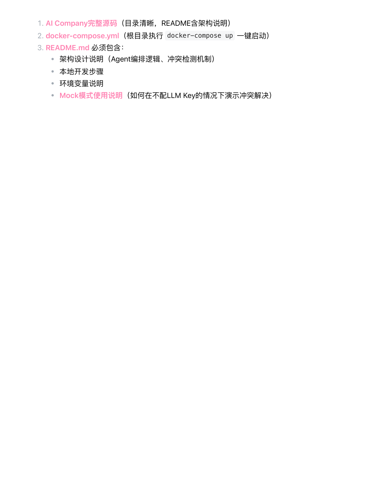

# "AI Software Company" 多Agent协作平台

> 来源 PDF: `_AI Software Company_ 多Agent协作平台.pdf`
>
> 解析说明: PDF 共 4 页。原文件中的架构/流程图主要由文本和线框绘制，不是嵌入式位图；本 Markdown 同时保留结构化内容、原始 ASCII 图、Mermaid 重绘图，并附上页面渲染图用于逐页对照。

## 页面对照

| 页码 | 内容范围 | 页面截图 |
| --- | --- | --- |
| Page 1 | 题目背景、Agent角色与职责、协作流程前半段 | [page-001](assets/ai-software-company-page-001.png) |
| Page 2 | 协作流程收尾、冲突解决机制、人类CTO审核点、核心功能需求前半段 | [page-002](assets/ai-software-company-page-002.png) |
| Page 3 | 项目详情页布局续图、产物交付、LLM集成与Mock模式、示例、交付物标题 | [page-003](assets/ai-software-company-page-003.png) |
| Page 4 | 交付物清单 | [page-004](assets/ai-software-company-page-004.png) |

---

## 工程题

构建 **"AI Software Company" 多Agent协作平台**。

## 一、题目背景

你要构建一个模拟真实软件公司运作的全栈平台。用户作为"人类CTO"，输入产品需求后，平台自动协调 5 个 AI Agent 角色，按非线性协作模式完成产品从 0 到 1 的构建。

核心亮点是:

- Agent 之间并行工作
- 存在依赖关系
- 可能出现冲突需要协调

来源: Page 1

## 二、Agent角色与职责

| Agent | 角色 | 职责 | 产出 |
| --- | --- | --- | --- |
| PM Agent | 产品经理 | 分析需求，编写 PRD（功能列表、用户故事） | Markdown PRD |
| Architect Agent | 架构师 | 基于 PRD 设计技术架构、数据库模型、API 契约（OpenAPI 风格） | Markdown 架构文档 |
| Frontend Agent | 前端工程师 | 基于 PRD + API 契约，生成前端页面代码 | React/HTML + JS 代码 |
| Backend Agent | 后端工程师 | 基于 PRD + API 契约，生成后端 API 实现代码 | Python/Node.js API 代码 |
| QA Agent | 测试工程师 | 基于 PRD + 前后端代码，生成测试用例和验收报告 | Markdown 测试计划 |

来源: Page 1

## 三、协作流程（非线性，含并行与冲突）

### 原始流程图截图



### 原始 ASCII 流程

```text
Phase 1: PM Agent 独立完成 PRD
    ↓
Phase 2: Architect Agent 基于PRD 完成架构设计 + API契约
    ↓
Phase 3: 【并行执行】Frontend Agent + Backend Agent 同时启动
         两者都依赖 Architect 的 API契约作为输入
    ↓
Phase 4: Orchestrator 进行【契约一致性检查】
         比较 Frontend代码中的API调用 与 Backend代码中的API实现
         → 一致：进入 Phase 5
         → 不一致：标记【冲突状态】，等待人类CTO决策
    ↓
Phase 5: QA Agent 基于最终产物生成测试报告
```

### Mermaid 重绘



来源: Page 1-2

## 冲突解决机制（必须实现）

当 Frontend Agent 和 Backend Agent 的 API 接口不一致时（如路径、方法、参数名差异），系统进入 `conflict` 状态。

1. 自动检测: Orchestrator 提取 Frontend 代码中的 `fetch/axios` 调用和 Backend 代码中的路由定义，进行字符串级比对。
2. 冲突展示: 在项目详情页高亮显示"冲突点"。示例: Frontend 调用 `/api/users` `GET`，Backend 实现 `/api/user` `POST`。
3. 人类CTO介入: 提供决策按钮。
   - "以前端为准": Backend Agent 重新执行，按 Frontend 的 API 调用修正实现。
   - "以后端为准": Frontend Agent 重新执行，按 Backend 的 API 实现修正调用。
   - "强制通过": 忽略冲突，直接进入 QA 阶段。
4. 重试执行: 选择对齐方向后，对应 Agent 重新执行，保留其他 Agent 产物不变。

对照备注: PDF 原文此处写的是"提供两个决策按钮"，但下方实际列出三个动作按钮；这里保留三个按钮作为功能事实。

来源: Page 2

## 人类CTO审核点（可选实现，加分项）

在任意 Agent 完成后，可设置 `human_review_required=true`（默认 `false`）。此时该 Agent 进入 `awaiting_review` 状态，人类 CTO 可:

- 查看产物并点击"通过"进入下一阶段。
- 或直接修改产物内容后点击"通过"。

来源: Page 2

## 四、核心功能需求

### 1. 项目管理

- 创建项目: 名称 + 需求描述。
- 项目列表: 展示所有项目及当前阶段状态。
- 项目详情页: 核心页面，必须包含指定区域。

来源: Page 2

### 2. 项目详情页布局要求

#### 原始跨页布局图截图



#### 原始 ASCII 布局

```text
┌─────────────────────────────────────┐
│  项目标题 | 状态标签 | [开始构建]按钮   │
├─────────────────────────────────────┤
│  协作流程图（可视化Pipeline）          │
│  ┌─────┐    ┌─────────┐             │
│  │ PM  │───→│Architect│             │
│  └──┬──┘    └───┬─────┘             │
│     │           ↓                    │
│     │    ┌──────┴──────┐             │
│     │    ↓             ↓             │
│     │ ┌────────┐   ┌────────┐         │
│     └→│Frontend│   │Backend │         │
│       └───┬────┘   └───┬────┘         │
│           └──────┬─────┘              │
│                  ↓                     │
│            ┌─────────┐                │
│            │Orchestrator│ 冲突检测    │
│            └────┬────┘                │
│                 ↓                     │
│            ┌─────────┐                │
│            │   QA    │                │
│            └─────────┘                │
├─────────────────────────────────────┤
│  产物查看区（点击Agent节点切换展示）    │
│  - Markdown渲染（PRD/架构/测试报告）   │
│  - 代码高亮（Frontend/Backend代码）    │
├─────────────────────────────────────┤
│  冲突解决区（仅在conflict状态显示）      │
│  - 红色高亮差异对比                   │
│  - [以前端为准] [以后端为准] [强制通过] │
├─────────────────────────────────────┤
│  执行日志流（时间倒序，可折叠）         │
└─────────────────────────────────────┘
```

#### 协作 Pipeline Mermaid 重绘



#### 页面区域要求

| 区域 | 要求 |
| --- | --- |
| 顶部标题区 | 项目标题、状态标签、`[开始构建]` 按钮 |
| 协作流程图 | 可视化 Pipeline，展示 PM、Architect、Frontend、Backend、Orchestrator、QA 的依赖和执行关系 |
| 产物查看区 | 点击 Agent 节点切换展示产物 |
| Markdown 渲染 | 展示 PRD、架构文档、测试报告 |
| 代码高亮 | 展示 Frontend/Backend 代码 |
| 冲突解决区 | 仅在 `conflict` 状态显示 |
| 冲突差异 | 红色高亮差异对比 |
| 冲突操作按钮 | `[以前端为准]`、`[以后端为准]`、`[强制通过]` |
| 执行日志流 | 时间倒序，可折叠 |

来源: Page 2-3

### 3. 产物交付

- 全部完成后，支持打包下载 ZIP，按 Agent 分文件夹。
- ZIP 包含: `prd.md`、`architecture.md`、`frontend/`、`backend/`、`qa_report.md`。

来源: Page 3

### 4. LLM集成与Mock模式

- LLM 模式: 通过 OpenAI-compatible API 调用，环境变量配置 `LLM_API_KEY`、`LLM_BASE_URL`、`LLM_MODEL`。
- Mock 模式（必须）: 未配置 API Key 时自动进入。每个 Agent 返回合理的模板内容，内容中动态替换项目名称和需求关键词。确保无 LLM 也能完整演示全流程（包括模拟冲突场景）。

来源: Page 3

### 5. 提供示例

```text
如用户需求： 设计并实现一个排课系统。
AI company能够自动完成整个排课系统的开发和设计并交付源码
```

来源: Page 3

## 五、交付物

1. AI Company 完整源码（目录清晰，README 含架构说明）。
2. `docker-compose.yml`（根目录执行 `docker-compose up` 一键启动）。
3. `README.md` 必须包含:
   - 架构设计说明（Agent 编排逻辑、冲突检测机制）。
   - 本地开发步骤。
   - 环境变量说明。
   - Mock 模式使用说明（如何在不配 LLM Key 的情况下演示冲突解决）。

来源: Page 4

---

## 附录：页面渲染图

### Page 1



### Page 2



### Page 3



### Page 4


