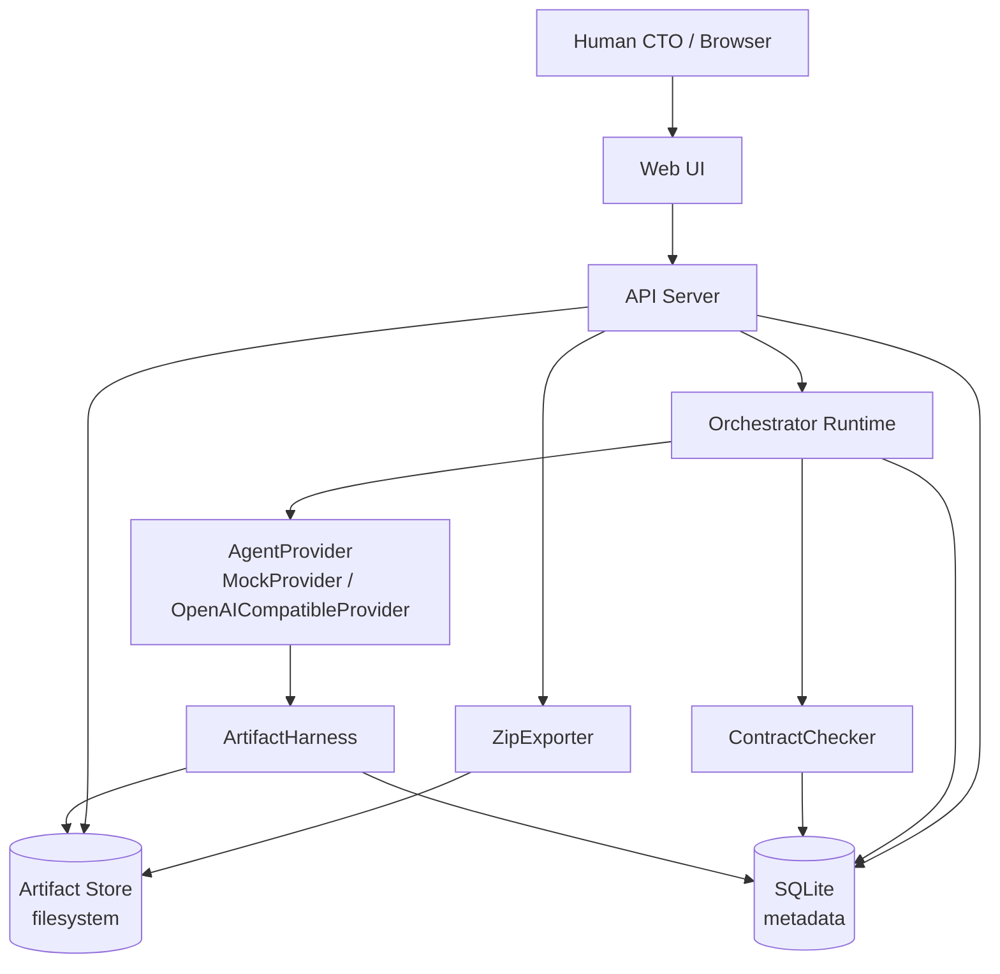
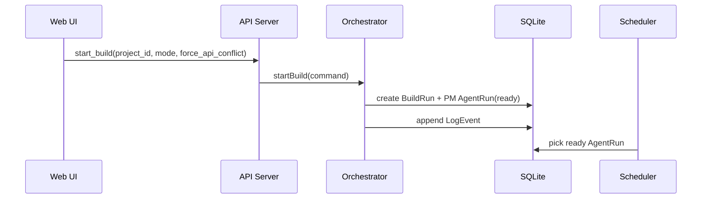
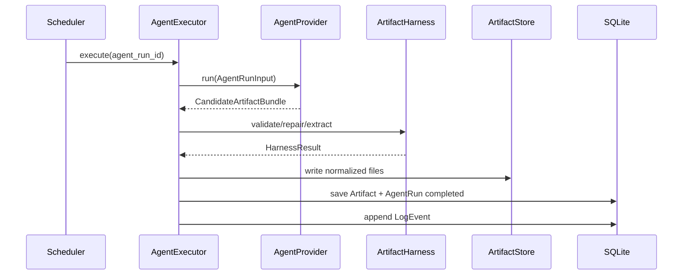
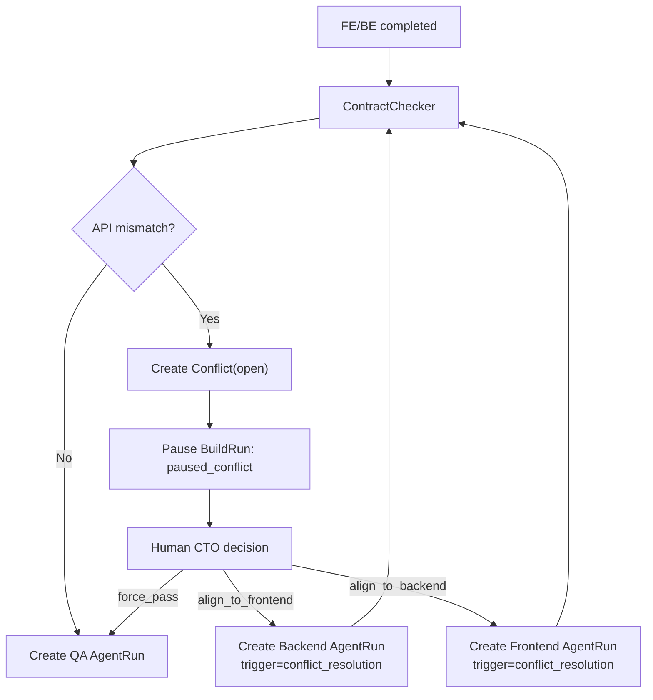

# AI Software Company - 平台技术架构 v0.1

> 依据:
> - `requirements-clarification-v0.1.md`
> - `state-machine-v0.1.md`
> - `artifact-harness-v0.1.md`
> - `agent-runtime-selection-v0.1.md`
>
> 当前深度: L1/L2。本文只锁定系统边界、模块职责、部署形态、数据流和持久化策略，不进入表字段、API DTO、UI 组件细节。

## 1. 结论

v0.1 平台建议采用 **单仓、单应用服务、SQLite、本地 artifact store、in-process scheduler**。

核心形态:

```text
Web UI + API Server + Orchestrator Runtime
  -> SQLite metadata DB
  -> local filesystem artifact store
  -> ZIP exporter
```

部署形态:

```text
docker-compose up
  -> app service
      -> serves Web UI
      -> exposes API
      -> runs Orchestrator scheduler in same process
      -> persists data under /app/data
```

明确不引入:

- Postgres。
- Redis。
- Celery/BullMQ 等外部队列。
- Temporal 等 durable workflow infra。
- LangGraph/CrewAI/AutoGen 作为核心 runtime。

原因:

- 工程题重点是状态机、协作边界、冲突处理、人类 CTO 决策和 artifact 质量门。
- v0.1 需要下载后稳定运行，部署组件越少越可控。
- SQLite 足够表达 `Project / BuildRun / AgentRun / Artifact / Conflict / ReviewGate / LogEvent` 的关系和查询。
- 本地文件系统更适合保存多文件 artifact 和 ZIP 输出。
- in-process scheduler 足够支撑本题的短生命周期任务、并行 FE/BE、retry 和 pause/resume。

## 2. 当前事实

已确认:

- `BuildRun` 是一次完整构建会话，不是单步 attempt。
- `AgentRun` 是单个 role 的一次 attempt。
- Agent raw output 必须经过 `ArtifactHarness` 才能成为有效 artifact。
- Harness repair 不消耗 retry。
- `Conflict` 只表示 Frontend/Backend API mismatch。
- Mock 模式必须完整可演示，且是默认路径。
- LLM 模式必须显式开启，配置错误不能 fallback 到 Mock。
- generated `frontend/` 和 `backend/` 下载后必须能独立运行。
- 设计文档先不 commit。

当前假设:

- v0.1 是交付给用户继续调整的中间迭代稿，但必须是完整可运行闭环。
- 面试官通过 README 和 Web UI 自助理解，不依赖固定演示人员逐步讲解。
- 主应用技术栈可以后续落定；平台架构不应绑定到某个 Agent framework 或某种 generated app 模板。

## 3. 架构边界

### 3.1 平台自身

平台自身负责:

- Web UI。
- 项目创建、构建启动、状态展示。
- Agent runtime 编排。
- Mock/LLM provider 调用。
- Artifact harness。
- Frontend/Backend API mismatch 检测。
- Human CTO review/conflict decision。
- 日志、产物查看、ZIP 下载。
- SQLite metadata 和 filesystem artifact 持久化。

### 3.2 Agent Provider

Provider 只负责生成候选产物:

```text
AgentRunInput -> CandidateArtifactBundle
```

Provider 不负责:

- 推进状态机。
- 决定 retry。
- 写 DB。
- 判断 Conflict。
- 直接生成最终 ZIP。

### 3.3 Generated App

generated `frontend/` 和 `backend/` 是平台产物，不是平台 runtime 的一部分。

它们需要:

- 被 ArtifactHarness 校验固定结构。
- 包含清晰 README。
- 包含 run manifest。
- 下载后可以独立启动。

它们不需要:

- 和平台主应用使用同一技术栈。
- 在 docker-compose 主应用启动时一起作为服务启动。
- 参与平台自身的 scheduler。

## 4. L1 系统图



## 5. L2 模块划分

### 5.1 Web UI

职责:

- Project list。
- Project detail。
- Pipeline 状态图。
- Agent artifact viewer。
- Conflict panel。
- Review gate 操作。
- Build logs。
- ZIP 下载入口。
- Mock/LLM mode 与 `force_api_conflict` 显式选择。

不负责:

- 自己推导复杂状态。
- 自己制造冲突。
- 自己拼接 ZIP。

UI 只展示 API 返回的系统状态和 artifact 内容。

### 5.2 API Server

职责:

- 提供 Web UI 所需 HTTP API。
- 接收创建项目、启动构建、通过审核、处理冲突、下载 ZIP 等命令。
- 做基础参数校验。
- 调用 application services。

不负责:

- 直接调用 LLM。
- 直接执行 Agent 状态流转。
- 直接改写 artifact 文件内容。

### 5.3 Orchestrator Runtime

职责:

- 创建和推进 `BuildRun`。
- 根据状态机创建 `AgentRun`。
- 安排 PM -> Architect -> FE/BE parallel -> ContractCheck -> QA。
- 处理 retry。
- 处理 pause/resume。
- 记录 LogEvent。
- 将 provider、harness、contract checker 串起来。

内部模块:

```text
OrchestratorService
StateMachineReducer
AgentRunScheduler
AgentExecutor
ProviderAdapter
HarnessRunner
ContractCheckRunner
EventLogger
```

### 5.4 AgentRunScheduler

v0.1 使用 DB state + in-process scheduler。

职责:

- 查询 `AgentRun(status=ready)`。
- 标记为 `running`。
- 调用 `AgentExecutor`。
- 按结果推进状态机。
- 支持同一 BuildRun 内 FE/BE 并行执行。
- 进程重启后可从 SQLite 中恢复未完成任务。

约束:

- v0.1 不引入独立 worker 服务。
- v0.1 不引入外部 queue。
- 同一 app 实例运行，避免多实例并发调度问题。

### 5.5 AgentExecutor

职责:

```text
AgentRun
  -> build AgentRunInput
  -> call AgentProvider
  -> ProviderOutputAdapter
  -> ArtifactHarness
  -> persist ArtifactBundle / failure
```

失败分类必须沿用状态机文档:

- `provider_transient`
- `provider_config`
- `generation_invalid`
- `artifact_io`
- `contract_parse_error`
- `unknown`

### 5.6 ArtifactStore

职责:

- 保存 normalized artifact 文件树。
- 保存 raw output 引用。
- 保存 harness report。
- 保存 manifest 文件。
- 提供 artifact viewer 和 ZIP exporter 读取入口。

建议目录:

```text
data/
  app.db
  artifacts/
    {project_id}/
      {build_run_id}/
        {agent_run_id}/
          normalized/
          manifests/
          harness-report.json
          raw-output.txt
  exports/
    {project_id}/
      {build_run_id}.zip
```

规则:

- DB 只存 metadata、状态、路径、manifest 摘要。
- 多文件内容放 filesystem。
- Artifact 原则上不可变。
- ZIP 只从 latest valid/repaired artifacts 组装。

### 5.7 Repository Layer

职责:

- 封装 SQLite 访问。
- 提供事务边界。
- 保证状态更新和 LogEvent 追加一致。
- 支撑 Project detail 查询。
- 支撑 BuildRun/AgentRun 历史追踪。

不建议在 v0.1:

- 直接用 JSON 文件模拟 DB。
- 每个模块自己读写 SQLite。
- 把 artifact 内容塞进 DB。

### 5.8 ContractChecker

职责:

- 读取 latest Frontend API usage manifest。
- 读取 latest Backend route manifest。
- 比较 method/path/关键参数。
- mismatch 时创建 `Conflict(open)`。
- match 时推进 QA。

边界:

- 只处理 FE/BE API mismatch。
- Architect contract 可作为辅助证据。
- 提取失败属于 `contract_parse_error`，不是 Conflict。

### 5.9 ZipExporter

职责:

- 导出最新有效产物。
- 执行 export preflight。
- 生成 ZIP。
- 记录导出日志。

ZIP 至少包含:

```text
prd.md
architecture.md
api-contract.json
frontend/
backend/
qa_report.md
```

preflight 失败时不允许下载。

## 6. 数据流

### 6.1 Start Build



### 6.2 Agent Execution



### 6.3 Conflict Resolution



## 7. SQLite vs 文件记录

结论: v0.1 使用 SQLite + 文件系统混合持久化。

SQLite 放:

- Project。
- BuildRun。
- AgentRun。
- Artifact metadata。
- Conflict。
- ReviewGate。
- LogEvent。
- provider mode、failure category、attempt、trigger reason。

文件系统放:

- markdown。
- generated frontend/backend 文件树。
- manifest JSON 文件。
- harness report。
- raw output。
- ZIP。

SQLite 比纯文件记录更适合本项目，因为:

- 状态关系是强关系型的，不只是文档集合。
- retry、attempt、conflict、review gate 需要可查询和可追踪。
- pause/resume 需要可靠恢复。
- UI 需要按项目、构建、阶段、Agent、日志做组合查询。
- 写入状态和追加日志需要事务。
- docker-compose 下 SQLite 不增加额外服务。

纯文件记录的问题:

- 状态更新容易部分写入。
- 多个 JSON 文件之间一致性难保证。
- 查询 Project detail 和 pipeline 状态会变成手工扫描。
- 后续加 ReviewGate/Conflict 历史成本更高。

## 8. Docker Compose

v0.1 推荐最小 compose:

```text
services:
  app:
    build: .
    ports:
      - "3000:3000"
    environment:
      PROVIDER_MODE_DEFAULT: mock
      DATA_DIR: /app/data
      LLM_BASE_URL: ${LLM_BASE_URL:-}
      LLM_MODEL: ${LLM_MODEL:-}
      LLM_API_KEY: ${LLM_API_KEY:-}
    volumes:
      - ./data:/app/data
```

说明:

- 默认 Mock 模式。
- 不设置 `LLM_API_KEY` 也能完整跑通。
- 选择 LLM 时，如果配置缺失或错误，应进入 `provider_config` failure。
- 不自动 fallback 到 Mock。
- `./data` 可删除后重新开始，也可保留历史构建。

## 9. 主应用技术栈建议

本文不强制把平台 runtime 绑定到某个语言，但为了 v0.1 快速交付，建议后续实现采用一个容易说明和部署的单仓全栈方案。

推荐方向:

- Web UI: React 类前端。
- API/Runtime: 同仓后端服务。
- Persistence: SQLite。
- Artifact: local filesystem。
- Packaging: Dockerfile + docker-compose。

更具体的技术栈可以在下一轮单独确认。选择标准应是:

- 一条命令启动。
- Dockerfile 简单。
- SQLite 支持成熟。
- 文件读写和 ZIP 生成直接。
- 前端状态页开发快。
- 面试官能容易读懂目录结构。

不建议把技术栈选择和 Agent Runtime 选择混在一起。Agent Runtime 的核心是状态模型和模块边界，不是 Node/Python/Java 的选择。

## 10. 验收检查

平台架构 v0.1 的验收条件:

1. `docker-compose up` 后能打开 Web UI。
2. 无 `LLM_API_KEY` 时，Mock 模式能跑完整 BuildRun。
3. Project detail 能看到 pipeline、artifact、logs。
4. 开启 `force_api_conflict` 后能进入 Conflict，并通过 CTO decision 恢复。
5. Conflict resolution 创建新的 FE 或 BE AgentRun，并保留原 attempt 历史。
6. Harness report 可查看或至少可从 artifact 目录追踪。
7. ZIP export 只使用 latest valid/repaired artifacts。
8. 下载 ZIP 后，`frontend/` 和 `backend/` 有独立 README 和启动命令，并能实际运行。
9. 选择 LLM 模式但配置错误时明确失败，不 fallback。
10. 重启 app 后，历史项目、构建状态、artifact 路径和日志仍可查看。

## 11. 分阶段实现建议

### Phase 1: Skeleton

- 输出: 单仓应用骨架、docker-compose、SQLite 初始化、Web UI 空壳。
- 验证: `docker-compose up` 能打开 UI 和 health API。
- 风险: 技术栈初始化过重。
- Owner: platform。

### Phase 2: State And Persistence

- 输出: Project、BuildRun、AgentRun、LogEvent 基础存取。
- 验证: 创建项目、启动 BuildRun、看到 pipeline 状态。
- 风险: 状态模型被 UI 简化覆盖。
- Owner: platform。

### Phase 3: Mock Provider And Harness

- 输出: PM/Architect/Frontend/Backend/QA MockProvider + basic harness。
- 验证: 无 LLM Key 完整生成 artifacts。
- 风险: Mock 绕过真实 runtime。
- Owner: runtime/harness。

### Phase 4: Parallel And Conflict

- 输出: FE/BE 并行、manifest extraction、ContractChecker、Conflict panel、CTO decision。
- 验证: `force_api_conflict=true` 能暂停、决策、重跑并继续 QA。
- 风险: 把 mismatch 当 failed 处理。
- Owner: runtime/ui。

### Phase 5: Export And README

- 输出: ZIP exporter、generated app README、主 README。
- 验证: 下载 ZIP 后 `frontend/` / `backend/` 可独立运行。
- 风险: export preflight 与 harness 契约不一致。
- Owner: platform/docs。

### Phase 6: LLM Adapter

- 输出: OpenAI-compatible provider、配置页或环境变量说明、错误展示。
- 验证: Mock 默认仍可跑通；LLM 配置错误明确 `provider_config`。
- 风险: LLM 质量影响主验收路径。
- Owner: provider。

## 12. 后续待确认

1. 主应用具体技术栈: TypeScript full-stack 还是 Python backend + React frontend。
2. generated `frontend/` / `backend/` 的模板技术栈。
3. v0.1 是否在 ZIP 导出前自动执行 generated app smoke test。当前建议: 第一版先做到 artifact 静态 gate + 手动运行验收；最终面试交付前再补自动 smoke。
4. UI 是否需要内置一个示例需求按钮。当前建议: 可以有，但不能替代用户创建项目流程。

## 13. 变更记录

- v0.1: 锁定单应用服务、SQLite、本地 artifact store、in-process scheduler 的平台架构方向。
