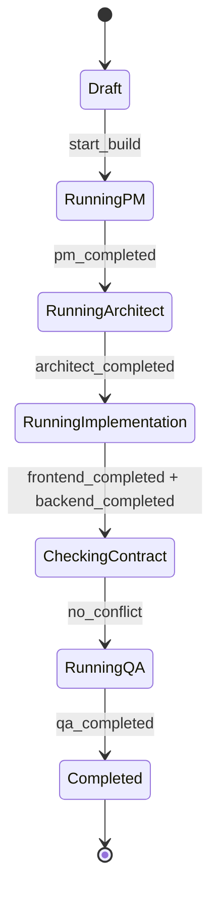
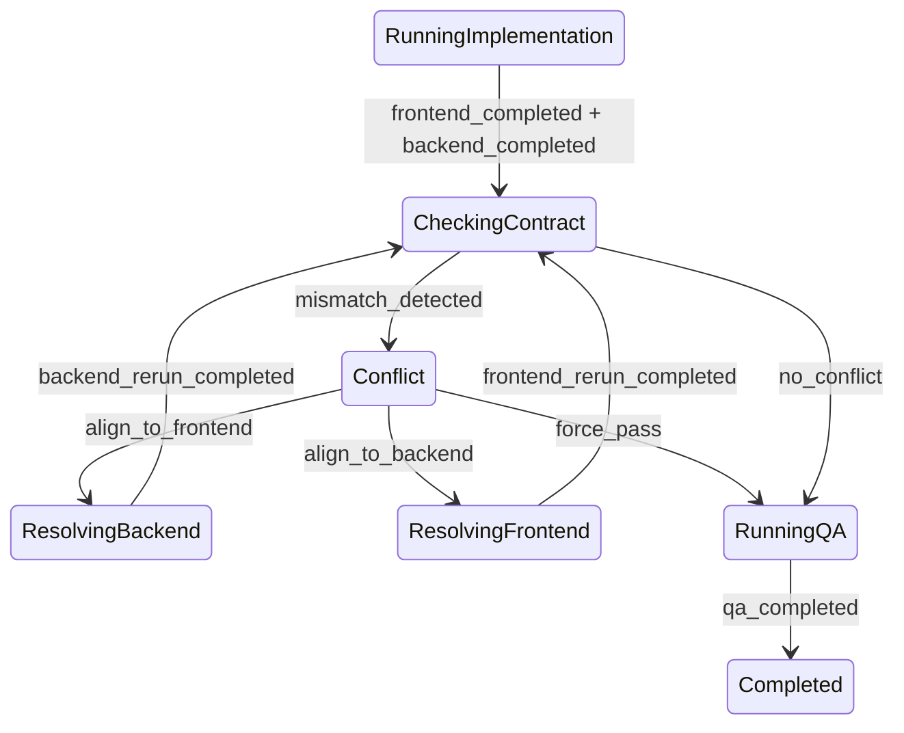
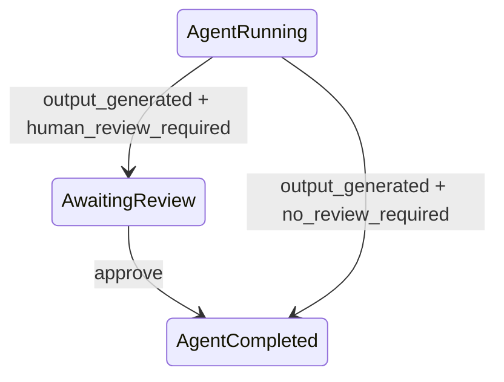

# AI Software Company - 状态机草案 v0.1

> 依据: `requirements-clarification-v0.1.md`
>
> 目标: 定义 v0.1 的核心状态、实体关系和流转规则。该状态机必须同时支撑 Mock 模式、LLM adapter、并行 Agent、冲突解决、人类 CTO 审核、日志和 ZIP 导出。

## 1. 设计结论

状态机不要只放一个 `project.status`。建议拆成:

- `Project`: 用户创建的项目，承载名称、需求、当前展示状态。
- `BuildRun`: 一次完整构建会话，从 PM 到 QA 的完整执行实例；它不是单步尝试。
- `AgentRun`: 某个 Agent 的一次 attempt；同一 BuildRun + role 可以有多条 AgentRun。
- `Artifact`: Agent 产物，原则上不可变，重跑产生新版本。
- `ArtifactHarness`: 对 Agent 输出做确定性校验、规范化、补齐固定文件和提取 manifest。
- `Conflict`: Orchestrator 检测出的 Frontend/Backend API 契约不一致记录。
- `ReviewGate`: 人类 CTO 审核点。
- `LogEvent`: 追加式事件日志。

核心原则:

- `Project.status` 面向 UI，可由当前 `BuildRun` 派生。
- 一个 Project 可以有多次历史 `BuildRun`，但同一时间只允许一个 `active_build_run_id`。
- `BuildRun` 是构建会话，内部可以包含 Agent retry、harness repair、冲突对齐重跑和人类审核。
- 新 `BuildRun` 只在用户重新构建、改需求、切 Mock/LLM 模式、失败后重新跑等场景出现。
- `BuildRun` 之间可以继承上下文，但必须通过 `parent_build_run_id` / `context_policy` 显式表达，不允许隐式混用历史产物。
- `AgentRun` 是一次 attempt，决定单个 Agent 的某次执行是否完成、等待审核、失败或被重跑替代。
- `Artifact` 不应被覆盖，重跑产生新 artifact，旧 artifact 保留为历史。
- Agent 原始输出必须先经过 `ArtifactHarness`，只有通过校验或被 harness 补齐后，才算有效 Artifact。
- `Conflict` 是业务流程态，不是 failed，不是 UI 假标签，也不只是日志。
- v0.1 的 `Conflict` 只表示 Frontend/Backend API mismatch；LLM 配置错误、产物缺文件、manifest 提取失败、QA 风险都不进入 Conflict。
- v0.1 同一 BuildRun 只允许一个 open Conflict，但一个 Conflict 可以包含多个 structured mismatches。
- 可重试失败优先 retry；只有不可重试或重试耗尽时，`BuildRun` 才进入 `failed`。

## 2. 核心实体

### 2.1 Project

```text
Project {
  id
  name
  requirement
  status
  active_build_run_id
  provider_mode_preference  // mock | llm
  force_api_conflict        // boolean
  human_review_required     // boolean
  created_at
  updated_at
}
```

`Project.status` 建议值:

| 状态 | 含义 |
| --- | --- |
| `draft` | 已创建，尚未开始构建 |
| `running` | 当前 BuildRun 正在推进 |
| `awaiting_review` | 当前 BuildRun 暂停，等待人类 CTO 审核 |
| `conflict` | 当前 BuildRun 暂停，等待人类 CTO 处理 API 冲突 |
| `completed` | 当前 BuildRun 完成，ZIP 可下载 |
| `failed` | 当前 BuildRun 失败，需要查看日志 |

### 2.2 BuildRun

```text
BuildRun {
  id
  project_id
  parent_build_run_id
  context_policy       // fresh | inherit_project_input | inherit_selected_artifacts
  status
  stage
  provider_mode_actual  // mock | llm
  failure_category
  started_at
  completed_at
  failed_reason
}
```

`BuildRun` 是一次完整构建会话，不是一轮单步尝试。以下动作都发生在同一个 BuildRun 内:

- Agent retry。
- Harness repair。
- 冲突对齐重跑。
- 人类 CTO 审核。

新建 BuildRun 的典型场景:

- 用户点击“重新构建”。
- 用户修改项目需求后重新构建。
- 用户切换 Mock/LLM 模式后重新构建。
- 当前 BuildRun 最终 failed 后，用户选择在同一 Project 下重新跑。

`context_policy`:

| 策略 | 含义 |
| --- | --- |
| `fresh` | 不继承历史产物，只使用当前 Project 输入 |
| `inherit_project_input` | 继承项目名称/需求/配置，但不继承历史产物 |
| `inherit_selected_artifacts` | 显式继承用户选择的历史 artifact，必须记录来源 |

规则:

- v0.1 默认使用 `fresh` 或 `inherit_project_input`。
- 不允许隐式读取上一轮 BuildRun 的 Artifact 作为当前输入。
- 如果未来支持继承历史产物，必须在 UI 和日志中可见。

`BuildRun.status` 建议值:

| 状态 | 含义 |
| --- | --- |
| `pending` | 已创建，等待开始 |
| `running` | 正在执行 |
| `paused_review` | 因审核点暂停 |
| `paused_conflict` | 因 API 冲突暂停 |
| `completed` | 全流程完成 |
| `failed` | 执行失败 |

`BuildRun.stage` 建议值:

| 阶段 | 含义 |
| --- | --- |
| `pm` | PM Agent 生成 PRD |
| `architect` | Architect Agent 生成架构和 API 契约 |
| `implementation` | Frontend / Backend 并行生成 |
| `contract_check` | Orchestrator 做一致性检查 |
| `conflict_resolution` | 等待或执行冲突解决 |
| `qa` | QA Agent 生成报告 |
| `ready_for_export` | 构建完成，等待/允许下载 ZIP |

### 2.3 AgentRun

```text
AgentRun {
  id
  build_run_id
  role              // pm | architect | frontend | backend | qa
  status
  attempt_no
  trigger_reason    // initial | retry | conflict_resolution | manual_rerun
  provider_mode     // mock | llm
  input_artifact_ids
  output_artifact_ids
  alignment_mode    // none | align_to_frontend | align_to_backend
  failure_category
  retryable
  retry_of_agent_run_id
  resolves_conflict_id
  started_at
  completed_at
  failed_reason
}
```

`AgentRun` 本身就是一次 attempt。不要再在 AgentRun 内部嵌套 attempt 列表。

同一个 `BuildRun + role` 可以有多条 AgentRun:

- 初次执行: `trigger_reason=initial`。
- 失败重试: `trigger_reason=retry`，并设置 `retry_of_agent_run_id`。
- 冲突对齐重跑: `trigger_reason=conflict_resolution`，并设置 `resolves_conflict_id`。
- 未来人工触发重跑: `trigger_reason=manual_rerun`。

`AgentRun.status` 建议值:

| 状态 | 含义 |
| --- | --- |
| `pending` | 尚未满足执行条件 |
| `ready` | 输入齐备，可以执行 |
| `running` | 正在执行 |
| `awaiting_review` | 产物已生成，等待 CTO 通过 |
| `completed` | 已完成并通过 |
| `failed` | 执行失败 |
| `superseded` | 被重跑版本替代 |

### 2.4 Artifact

```text
Artifact {
  id
  project_id
  build_run_id
  agent_run_id
  type              // prd | architecture | api_contract | frontend | backend | qa_report
  path
  content_preview
  version
  created_at
}
```

规则:

- AgentRun 的原始输出先进入 harness 校验与规范化。
- Harness 可以创建确定性的固定文件，例如 `prd.md` 文件名、README、manifest、启动脚本占位等。
- Harness 可以修复格式外壳，例如补齐 Markdown 标题、frontmatter、文件树、API manifest 包装。
- Harness 不应该替 Agent 编造核心业务内容；核心内容缺失时应要求 Agent retry。
- AgentRun 每次成功都生成新的 Artifact。
- 重跑时不要覆盖旧 Artifact。
- UI 默认展示每个 role 的最新有效 Artifact。
- ZIP 使用最新有效 Artifact 组装。

### 2.4.1 ArtifactHarness

详细契约见 `artifact-harness-v0.1.md`。本节只保留状态机层面的摘要。

```text
ArtifactHarness {
  role
  required_files
  required_sections
  validators
  normalizers
  manifest_extractors
}
```

每个 Agent 都有对应 harness:

| role | Harness 职责 |
| --- | --- |
| `pm` | 确保生成 `prd.md`，包含目标、用户故事、功能列表、验收标准等章节 |
| `architect` | 确保生成 `architecture.md` 和结构化 `api_contract` |
| `frontend` | 确保生成 `frontend/` 文件树、启动入口、API usage manifest |
| `backend` | 确保生成 `backend/` 文件树、启动入口、route manifest |
| `qa` | 确保生成 `qa_report.md`，包含测试用例、验收结论、风险 |

Harness 处理结果:

| 结果 | 含义 | 下一步 |
| --- | --- | --- |
| `valid` | 原始输出满足契约 | 保存 Artifact |
| `repaired` | 通过确定性规则补齐外壳后满足契约 | 保存 Artifact，并记录 repair log |
| `invalid_retryable` | 核心内容缺失或结构严重错误，但可能通过重跑修复 | 进入 retry |
| `invalid_final` | 明确不可修复，或 retry 后仍失败 | 标记 `generation_invalid` |

### 2.5 Conflict

```text
Conflict {
  id
  build_run_id
  status
  frontend_agent_run_id
  backend_agent_run_id
  frontend_api_usages
  backend_routes
  mismatches
  decision
  resolution_agent_run_id
  resolved_by
  created_at
  resolved_at
}
```

`Conflict` 的范围必须收窄:

- v0.1 只表示 Frontend/Backend API 契约不一致。
- 它必须引用产生冲突的 Frontend/Backend AgentRun attempt。
- 它必须保存 structured mismatches，而不是只写文本日志。
- 它必须记录 CTO decision。
- 解决它的新 AgentRun 必须通过 `AgentRun.resolves_conflict_id` 指回该 Conflict。
- `Conflict.resolution_agent_run_id` 记录最终用于解决冲突的 AgentRun；`force_pass` 时可以为空。
- v0.1 同一 BuildRun 只允许一个 `open` Conflict。
- 一个 Conflict 内可以包含多个 mismatches。

不属于 `Conflict` 的问题:

- LLM 配置错误。
- Provider 超时/429。
- Artifact 缺文件。
- Harness 校验失败。
- Manifest 提取失败。
- QA 风险提示。

`Conflict.status` 建议值:

| 状态 | 含义 |
| --- | --- |
| `open` | 检测到冲突，等待 CTO 决策 |
| `resolving` | 已选择对齐方向，正在重跑对应 Agent |
| `resolved` | 重跑后检测通过 |
| `forced` | CTO 选择强制通过 |

`Conflict.decision` 建议值:

| 决策 | 行为 |
| --- | --- |
| `align_to_frontend` | Backend Agent 重跑，按 Frontend API 调用修正 |
| `align_to_backend` | Frontend Agent 重跑，按 Backend 路由修正 |
| `force_pass` | 不重跑，直接进入 QA |

### 2.6 ReviewGate

```text
ReviewGate {
  id
  build_run_id
  agent_run_id
  status
  reviewer
  created_at
  approved_at
}
```

`ReviewGate.status`:

| 状态 | 含义 |
| --- | --- |
| `open` | 等待 CTO 审核 |
| `approved` | 已通过 |
| `skipped` | 当前配置下不需要审核 |

v0.1 只要求“查看 + 通过”。完整编辑器后续实现，但 Artifact 模型要允许未来出现人工修改版本。

## 3. 主流程状态转移

### 3.1 正常无冲突路径



### 3.2 冲突路径



### 3.3 审核路径

审核点是插入态，不改变主阶段的先后顺序。



规则:

- 如果 PM 需要审核，Architect 必须等 PM 审核通过。
- 如果 Architect 需要审核，Frontend/Backend 必须等 Architect 审核通过。
- 如果 Frontend/Backend 需要审核，Orchestrator 必须等两者均审核通过。
- 如果 QA 需要审核，BuildRun 完成前必须等 QA 审核通过。

## 4. 并行执行规则

Frontend 与 Backend 的并行不是 UI 效果，而是状态机规则:

1. Architect 完成并通过审核后，创建两个 `AgentRun`:
   - `frontend` attempt 1
   - `backend` attempt 1
2. 两者状态都从 `ready` 进入 `running`。
3. BuildRun.stage = `implementation`。
4. 只有当最新有效 Frontend 和 Backend AgentRun 都 `completed` 后，才能进入 `contract_check`。
5. 任一 AgentRun 失败时，先进入失败分类与重试规则；只有不可重试或重试耗尽时，BuildRun.status = `failed`，Project.status = `failed`。

## 5. 冲突解决规则

### 5.1 检测输入

Orchestrator 使用最新有效产物:

- Frontend Artifact 中提取的 API usage manifest。
- Backend Artifact 中提取的 route manifest。
- Architect Artifact 中的 API contract 可作为辅助对照。

### 5.2 检测输出

如果不一致，创建 `Conflict`:

```text
Conflict {
  status: open
  mismatches: [
    {
      frontend: { method: "GET", path: "/api/courses" },
      backend: { method: "POST", path: "/api/course" },
      reason: "method/path mismatch"
    }
  ]
}
```

同时:

- BuildRun.status = `paused_conflict`
- BuildRun.stage = `conflict_resolution`
- Project.status = `conflict`
- 写入 `LogEvent`

### 5.3 以前端为准

动作: `resolve_conflict(decision=align_to_frontend)`

结果:

1. Conflict.status = `resolving`。
2. 最新 Backend AgentRun 标记为 `superseded`。
3. 创建 Backend AgentRun attempt + 1。
4. 新 Backend AgentRun 输入包含:
   - 原 PRD。
   - 架构文档/API 契约。
   - Frontend API usage manifest。
   - alignment_mode = `align_to_frontend`。
5. 新 Backend AgentRun 设置 `trigger_reason=conflict_resolution` 和 `resolves_conflict_id`。
6. Backend 重跑完成后，重新进入 `contract_check`。
7. 冲突解决成功后，Conflict.status = `resolved`，并记录 `resolution_agent_run_id`。

### 5.4 以后端为准

动作: `resolve_conflict(decision=align_to_backend)`

结果:

1. Conflict.status = `resolving`。
2. 最新 Frontend AgentRun 标记为 `superseded`。
3. 创建 Frontend AgentRun attempt + 1。
4. 新 Frontend AgentRun 输入包含:
   - 原 PRD。
   - 架构文档/API 契约。
   - Backend route manifest。
   - alignment_mode = `align_to_backend`。
5. 新 Frontend AgentRun 设置 `trigger_reason=conflict_resolution` 和 `resolves_conflict_id`。
6. Frontend 重跑完成后，重新进入 `contract_check`。
7. 冲突解决成功后，Conflict.status = `resolved`，并记录 `resolution_agent_run_id`。

### 5.5 强制通过

动作: `resolve_conflict(decision=force_pass)`

结果:

1. Conflict.status = `forced`。
2. BuildRun.stage = `qa`。
3. QA Agent 输入中必须包含冲突记录和 `force_pass` 决策。
4. QA 报告需要标注该风险。
5. `resolution_agent_run_id` 可以为空，因为没有通过重跑解决冲突。

## 6. 失败分类与重试规则

原始题目没有展开失败分类，但工程实现需要区分不同失败，否则面试官会看到一个粗糙的 `failed` 黑盒。v0.1 需要做到: 能重试的优先重试，不可重试的明确给出原因。

### 6.1 失败分类

| failure_category | 典型原因 | 是否优先 retry | v0.1 行为 |
| --- | --- | --- | --- |
| `provider_transient` | LLM 请求超时、429、临时网络错误 | 是 | 自动 retry 当前 Agent，超过次数后 failed |
| `provider_config` | 用户选择 LLM 但 Key/Base URL/Model 配置错误 | 否 | 标记 failed，提示改配置或明确切换到 Mock |
| `generation_invalid` | Agent 输出经 harness 校验/补齐后仍缺核心内容、schema 解析失败、生成代码缺入口 | 是 | retry 当前 Agent，仍失败则 failed |
| `artifact_io` | 写文件、打包 ZIP、读 artifact 失败 | 是 | retry 对应 IO 步骤；持续失败则 failed |
| `contract_parse_error` | 无法从前端/后端产物提取 API manifest | 是 | retry对应 Agent 或标记产物无效；持续失败则 failed |
| `human_rejected` | 未来人工审核驳回 | 可选 | v0.1 不实现 reject，仅预留 |
| `unknown` | 未分类异常 | 否 | failed，并要求日志包含堆栈/错误摘要 |

说明:

- Frontend/Backend API 不一致不是失败分类，它进入 `Conflict.status=open`。
- Manifest 提取失败是 `contract_parse_error`；提取成功但内容不一致才是 `Conflict`。

### 6.2 Retry 策略

建议 v0.1 默认策略:

| 场景 | max retries | 说明 |
| --- | --- | --- |
| MockProvider 生成无效 | 1 | Mock 应该稳定，失败多半是模板/代码 bug |
| LLM provider transient | 2 | 避免网络波动直接失败 |
| artifact IO | 1 | 避免临时文件系统问题 |
| manifest parse | 1 | 可能由生成内容小偏差导致 |

规则:

1. Agent 原始输出先进入 harness。
2. Harness 能确定性补齐外壳时，直接 repair，不消耗 retry。
3. Harness 判断核心内容缺失或结构严重错误时，才进入 `generation_invalid` retry。
4. 可重试失败发生时，原 AgentRun 记录为 `failed`，并带上 `retryable=true`。
5. Orchestrator 创建新的 AgentRun，`attempt_no = previous.attempt_no + 1`，`trigger_reason=retry`，`retry_of_agent_run_id = previous.id`。
6. BuildRun 保持 `running`，stage 不变。
7. 写入 LogEvent: 失败分类、harness 校验结果、重试次数、下一次执行的 AgentRun id。
8. 如果达到 max retries，BuildRun.status = `failed`，Project.status = `failed`。
9. 冲突解决导致的 Agent 重跑不算失败 retry，它属于 CTO 决策后的业务重跑。

### 6.3 UI 表达

UI 不需要把所有内部错误都暴露成复杂状态，但要能解释:

- 哪个 Agent 失败。
- 失败分类是什么。
- 是否已自动 retry。
- 当前是第几次 attempt。
- 如果最终 failed，下一步建议是什么。

## 7. Mock 与 LLM 的状态机关系

Mock/LLM 只影响 AgentRun 的执行实现，不影响流程状态。

```text
AgentRun(status=ready)
  -> AgentRunner
     -> ProviderAdapter
        -> MockProvider 或 OpenAICompatibleProvider
  -> Artifact
  -> AgentRun(status=completed 或 awaiting_review)
```

规则:

- `provider_mode_preference` 必须由明确开关选择 `mock` 或 `llm`。
- README 和默认项目创建流程建议默认选择 `mock`，满足无 LLM Key 演示。
- 选择 `mock` 时，`provider_mode_actual = mock`，不需要 `LLM_API_KEY`。
- 选择 `llm` 时，`provider_mode_actual = llm`，必须提供有效 `LLM_API_KEY` / `LLM_BASE_URL` / `LLM_MODEL`。
- 选择 `llm` 但配置错误时，不自动 fallback 到 Mock，而是进入 `provider_config` 失败。
- Mock 也必须生成真实 Artifact 和 manifest。
- Orchestrator 不关心产物来自 Mock 还是 LLM。

## 8. UI 状态映射

| UI 显示 | 来源 |
| --- | --- |
| 项目状态标签 | `Project.status` |
| Pipeline 节点状态 | 最新 `AgentRun.status` |
| 当前执行阶段 | `BuildRun.stage` |
| 是否显示 Review 区 | 存在 `ReviewGate.status=open` |
| 是否显示 Conflict 区 | 存在 `Conflict.status=open` |
| 是否允许下载 ZIP | `BuildRun.status=completed` |
| 日志流 | `LogEvent` |
| 失败与 retry 信息 | `AgentRun.failure_category` + `retryable` + `attempt_no` |
| AgentRun 来源 | `AgentRun.trigger_reason` |

## 9. v0.1 API 动作草案

| 动作 | 含义 |
| --- | --- |
| `create_project` | 创建项目 |
| `start_build` | 创建 BuildRun 并开始 PM |
| `approve_review_gate` | 人类 CTO 审核通过 |
| `retry_failed_agent` | 对可重试 AgentRun 发起手动 retry |
| `resolve_conflict_align_to_frontend` | 以前端为准 |
| `resolve_conflict_align_to_backend` | 以后端为准 |
| `resolve_conflict_force_pass` | 强制通过 |
| `download_zip` | 下载最新完成产物 |

## 10. 状态机与原始需求对照

| 原始需求 | 状态机覆盖 | 说明 |
| --- | --- | --- |
| 用户作为人类 CTO 输入需求 | 覆盖 | `Project.name` + `Project.requirement` |
| 自动协调 5 个 AI Agent | 覆盖 | `AgentRun.role` 覆盖 pm / architect / frontend / backend / qa |
| PM 独立完成 PRD | 覆盖 | `BuildRun.stage=pm`，输出 `Artifact.type=prd` |
| Architect 基于 PRD 完成架构和 API 契约 | 覆盖 | `BuildRun.stage=architect`，输出 architecture + api_contract |
| Frontend/Backend 并行执行 | 覆盖 | `BuildRun.stage=implementation` 下创建两个并行 AgentRun |
| 两者依赖 Architect API 契约 | 覆盖 | Frontend/Backend 的 `input_artifact_ids` 包含 api_contract |
| Orchestrator 契约一致性检查 | 覆盖 | `BuildRun.stage=contract_check`，读取 API manifests |
| 一致进入 QA | 覆盖 | `contract_check -> qa` |
| 不一致进入 conflict | 覆盖 | `Conflict.status=open` + `BuildRun.status=paused_conflict` |
| 冲突展示 | 覆盖 | `Conflict.mismatches` 供 UI Conflict 区展示，范围限于 FE/BE API mismatch |
| 以前端为准 | 覆盖 | `decision=align_to_frontend`，Backend 新 AgentRun，设置 `resolves_conflict_id` |
| 以后端为准 | 覆盖 | `decision=align_to_backend`，Frontend 新 AgentRun，设置 `resolves_conflict_id` |
| 强制通过 | 覆盖 | `decision=force_pass`，QA 输入包含风险 |
| 重试执行，保留其他产物不变 | 覆盖 | Artifact 不可变；被重跑一侧旧 AgentRun `superseded` |
| 人类 CTO 审核点 | 覆盖 v0.1 轻量版 | `ReviewGate` + `awaiting_review`；编辑产物后续扩展 |
| 项目列表展示阶段状态 | 覆盖 | `Project.status` + `BuildRun.stage` |
| 项目详情页 Pipeline | 覆盖 | UI 由最新 AgentRun 状态映射 |
| 产物查看区 | 覆盖 | Artifact 按 role/type 查询 |
| 冲突解决区仅 conflict 显示 | 覆盖 | 存在 `Conflict.status=open` 时显示 |
| 执行日志流 | 覆盖 | `LogEvent` 追加式事件 |
| ZIP 下载 | 覆盖 | 只允许 `BuildRun.status=completed` 后导出最新有效 Artifact |
| LLM/OpenAI-compatible | 覆盖接口层 | `provider_mode_actual=llm`，ProviderAdapter 预留 |
| Mock 模式必须 | 覆盖 | `provider_mode_actual=mock` 走同一状态机 |
| Mock 模拟冲突 | 覆盖 | `force_api_conflict` 影响生成内容，Orchestrator 仍真实检测 |
| Docker Compose / README | 状态机不直接覆盖 | 属于部署和文档交付，不应放进状态机 |

### 对照结论

当前状态机覆盖了原始需求里的核心流程、冲突机制、审核点、Mock/LLM 分流和产物导出。它还补足了原始题目没有细写但实现必须有的部分:

- Project 与 BuildRun 分离，BuildRun 是完整构建会话，支持历史构建。
- BuildRun 之间如需继承必须显式声明 `parent_build_run_id` / `context_policy`。
- AgentRun 即 attempt，配合 `trigger_reason`、`retry_of_agent_run_id`、`resolves_conflict_id` 支撑重跑和追溯。
- Artifact version 支撑“保留其他产物不变”。
- Conflict 独立建模，且仅表示 FE/BE API mismatch，避免 UI 假冲突和失败状态混用。
- Failure category 与 retry，避免所有异常都变成不可解释的 failed。

它不负责覆盖:

- `docker-compose.yml` 的具体服务编排。
- README 的文字内容。
- generated `frontend/` / `backend/` 的具体技术栈。

这些应在后续架构设计和交付清单中继续展开。

## 11. 已确认决策

1. v0.1 允许一个 Project 有多次历史 BuildRun，但同一时间只允许一个 active BuildRun。
2. 失败需要分类；能 retry 的优先 retry，重试耗尽或不可重试才进入最终 failed。
3. ZIP 下载只允许 `BuildRun.status=completed` 后执行。强制通过冲突也必须先进 QA，再 completed，再下载。
4. `human_review_required` 在 v0.1 是项目级开关，数据模型预留后续 Agent 级配置。
5. 普通 failed 后允许用户在同一个 Project 上创建新的 BuildRun。
6. Mock/LLM 必须通过明确开关选择；选择 LLM 后配置错误不能 fallback 到 Mock。
7. BuildRun 是一次完整构建会话，不是单步 attempt；Agent retry、harness repair、冲突对齐重跑、人类审核都发生在同一个 BuildRun 内。
8. BuildRun 之间可以继承，但必须通过 `parent_build_run_id` / `context_policy` 显式表达。
9. AgentRun 本身就是一次 attempt；用 `trigger_reason`、`retry_of_agent_run_id`、`resolves_conflict_id` 追踪来源。
10. v0.1 的 Conflict 只表示 Frontend/Backend API mismatch；其他错误走 failure category 或 QA risk。
11. v0.1 同一 BuildRun 只允许一个 open Conflict，但一个 Conflict 可以有多个 mismatches。

## 12. 待确认问题

暂无。下一步应展开 API 动作、数据模型字段和页面状态映射。
